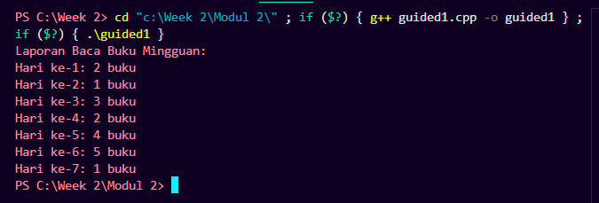
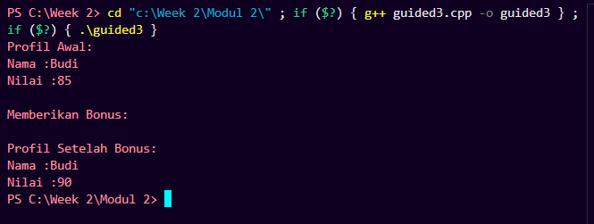
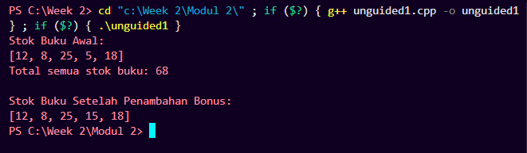

# Laporan Praktikum Struktur Data Week 2

## 1. Nama, NIM, Kelas
- **Nama**: Ariel Ahnaf Kusuma
- **NIM**: 103112400050
- **Kelas**: IF-12-05

## 2. Motivasi Belajar Struktur Data
Agar bisa menguasai bahasa C++

## 3. Dasar Teori
**Array C++**

Array adalah urutan objek dengan jenis yang sama yang menempati area memori yang berdampingan. Dalam C++, array adalah variabel yang dapat menyimpan beberapa nilai dengan tipe yang sama. Misalnya.

**Deklarasi dan insialisasi Array**

Dalam deklarasi array C++, ukuran array ditentukan setelah nama variabel, bukan setelah nama jenis seperti dalam beberapa bahasa lain.

Anda dapat menginisialisasi array dalam perulangan, satu elemen pada satu waktu, atau dalam satu pernyataan.

**Pointer C++**

Apa itu pointers? Dalam dunia pemrograman, pointer adalah salah satu konsep yang sangat penting dan khas dalam bahasa pemrograman C++. Secara sederhana, pointer adalah variabel yang menyimpan alamat memori dari suatu nilai atau objek. Ini memungkinkan kita untuk mengakses dan memanipulasi nilai atau objek tersebut dengan cara yang lebih efisien dan fleksibel.

**Deklarasi dan Inisialisasi Pointer** 

Dalam bahasa pemrograman C++, Kamu dapat mendeklarasikan pointer c++ dengan menggunakan operator *. Misalnya, deklarasi int *ptr akan membuat pointer ptr yang menunjuk ke alamat memori yang menyimpan nilai bilangan bulat.

**Pointer dan Array**

Pointer C++ memiliki hubungan yang kuat dengan array. Sebenarnya, nama array pada dasarnya adalah pointer yang menunjuk ke alamat memori awal dari array tersebut. Kamu dapat menggunakan pointer untuk mengakses dan memanipulasi elemen-elemen dalam array.

## 4. Guided
### 4.1 Guided 1

Source Code

#include <iostream>

using namespace std;

int main() {
    int bukuPerHari[7] = {2,1,3,2,4,5,1};
    int totalBuku = 0;

    cout << "Laporan Baca Buku Mingguan:" << endl;

    for (int i = 0; i < 7; i++) {
        cout << "Hari ke-" << (i + 1) << ": " << bukuPerHari[i] << " buku" << endl;
        totalBuku += bukuPerHari[i];
    }
}

Output

Penjelasan:
Fungsi Program ini adalah untuk menampilkan jumlah buku yang dibaca selama satu minggu. Di awal, ada array bukuPerHari[7] yang menyimpan jumlah buku yang dibaca dari hari pertama sampai hari ke tujuh. totalBuku dipakai untuk menngitung total semua buku yang dibaca. Lalu program nge-print teks “Laporan Baca Buku Mingguan” dan menggunakan perulangan for untuk menampilkan jumlah buku tiap hari satu per satu, dengan menambahkan totalnya ke totalBuku.

### 4.2 Guided 2

Source Code

#include <iostream>

using namespace std;

int main() {
    float hargaProduk = 50000.0;
    float* ptrHarga;
    ptrHarga = &hargaProduk;

    cout << "Harga Awal Produk: Rp " << hargaProduk << endl;
    cout << "Alamat Memori Harga: " << ptrHarga << endl;

    cout << "\n...Memberikan diskon 10% melalui pointer..." << endl;
    *ptrHarga = *ptrHarga * 0.9;
    cout << "Harga Setelah Diskon: Rp " << hargaProduk << endl;

    return 0;
}

Output

Penjelasan:
Fungsi Programn ini yaitu untuk menunjukan cara kerja pointer, adanya variabel hargaProduk senilai 50.000, lalu pointer ptrHarga dibuat untuk menyimpan alamat dari variabel itu. Program pertama menampilkan harga awal, setelah itu lewat pointer, program mengasih diskon 10% dengan cara mengubah langsung nilai di hargaProduk. Hasil akhirnya, harga produk berubah jadi 45.000, tanpa harus merubah variabel aslinya

### 4.3 Guided 3

Source Code

#include <iostream>
#include <string>
using namespace std;

float hitungRataRata(int nilaiTugas, int nilaiUTS) {
    return (nilaiTugas + nilaiUTS) / 2.0;
}

void cetakProfil(string nama, float nilai) {
    cout << "Nama :" << nama << endl;
    cout << "Nilai :" << nilai << endl;
}

void berNilaiBonus(float &nilai) {
    nilai += 5.0f;
}

int main() {
    string namaSiswa = "Budi";
    int tugas = 80, uts = 90;

    float nilaiAkhir = hitungRataRata(tugas, uts);

    cout << "Profil Awal:" << endl;
    cetakProfil(namaSiswa, nilaiAkhir);

    cout << "\nMemberikan Bonus:" << endl;
    berNilaiBonus(nilaiAkhir);

    cout << "\nProfil Setelah Bonus:" << endl;
    cetakProfil(namaSiswa, nilaiAkhir);

    return 0;
}

Output

Penjelasan:
Fungsi Program ini dibuat menghitung dan menampilkan nilai akhir seorang siswa, lalu memberi bonus nilai pakai fungsi. Fungsi hitungRataRata() yang menghitung rata-rata dari nilai tugas dan UTS. Fungsi cetakProfil() untuk menampilkan nama dan nilai siswa, dan berNilaiBonus() menambah 5 poin ke nilai lewat referensi. main(), data siswa “Budi” diinput manual dengan nilai tugas 80 dan UTS 90, lalu dihitung rata-ratanya dan ditampilkan. Setelah itu, program kasih bonus nilai, lalu cetak ulang hasil akhirnya.

## 5. Unguided
### 5.1 Unguided 1

Source Code

#include <iostream>
using namespace std;

void cetakStok(int arr[], int size) {
    cout << "[";
    for (int i = 0; i < size; i++) {
        cout << arr[i] << (i == size - 1 ? "" : ", ");
    }
    cout << "]" << endl;
}

int hitungTotalStok(int arr[], int size) {
    int total = 0;
    for (int i = 0; i < size; i++) {
        total += arr[i];
    }
    return total;
}

int* cariStokPalingSedikit(int arr[], int size) {
    int* ptrPalingSedikit = &arr[0];

    for (int i = 1; i < size; i++) {
        if (arr[i] < *ptrPalingSedikit) {
            ptrPalingSedikit = &arr[i];
        }
    }

    return ptrPalingSedikit;
}

void tambahStokBonus(int* ptrStok) {
    *ptrStok += 10; 
}

int main() {
    int stokBuku[] = {12, 8, 25, 5, 18};
    int jumlahJenisBuku = 5;

    cout << "Stok Buku Awal:" << endl;
    cetakStok(stokBuku, jumlahJenisBuku);

    int total = hitungTotalStok(stokBuku, jumlahJenisBuku);
    cout << "Total semua stok buku: " << total << endl;

    int* ptrStokRendah = cariStokPalingSedikit(stokBuku, jumlahJenisBuku);
     tambahStokBonus(ptrStokRendah);

    cout << "\nStok Buku Setelah Penambahan Bonus:" << endl;
    cetakStok(stokBuku, jumlahJenisBuku);

    return 0;
}

Output

Penjelasan:
Fungsi program ini adalah untuk mengelola stok buku dengan bantuan array dan pointer.fungsi cetakStok() hanya untuk menampilkan isi array agar rapi seperti daftar [12, 8, 25, 5, 18]. Lalu hitungTotalStok() menghitung total semua stok buku dengan nge-loop tiap elemen lalu jumlahkan. Fungsi cariStokPalingSedikit() tugasnya mencaari stok yang paling kecil, dan dia mengembalikan alamat (pointer) dari elemen itu. Setelah ketemu, fungsi tambahStokBonus() dipanggil buat nambahin stoknya sebesar 10 lewat pointer tadi.

## 6. Kesimpulan
Dalam praktikum ini kita diajarkan konsep array, pointer dan fungsi yang ada pada C++ ini termsuk pondasi untuk apa yang akan datang nanti di masa depan, dan juga untuk materi materi modul yang lebih sulit nantinya

## 7. Referensi
1. [Buku atau artikel yang Anda gunakan untuk referensi, jika ada]
2. [Sumber lain yang relevan dengan topik praktikum ini]