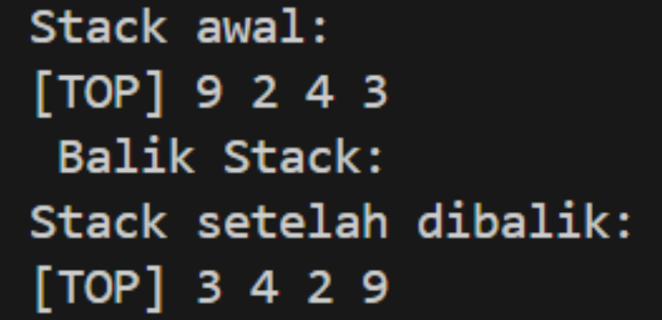
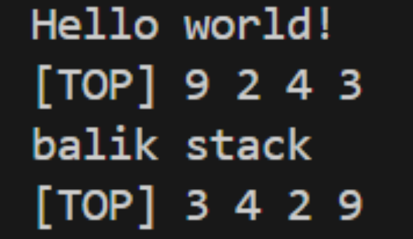
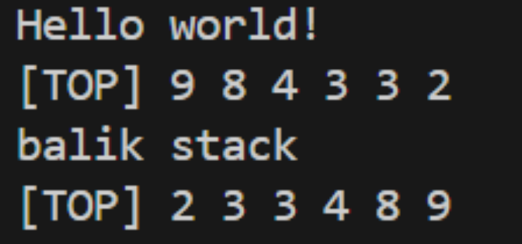
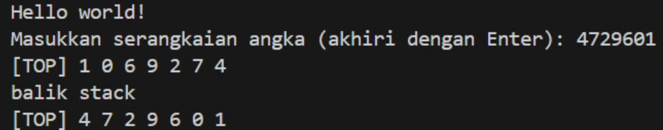

# Laporan Praktikum Struktur Data Week 7

## 1. Nama, NIM, Kelas
- **Nama**: Ariel Ahnaf Kusuma
- **NIM**: 103112400050
- **Kelas**: IF-12-05

## 2. Motivasi Belajar Struktur Data
Agar lebih dapat mempelajari lebih dalam tentang bahasa ini

## 3. Dasar Teori
### Stack 
Stack adalah sebuah kumpulan data dimana data yang diletakkan di atas data  yang lain. Dengan demikian stack adalah struktur data yang menggunakan konsep LIFO(Last In First Out). Dengan demikian, elemen terakhir yang disimpan dalam stack menjadi elemen pertama yang diambil. Dalam proses komputasi, untuk meletakkan sebuah elemen pada bagian atas dari stack, maka dilakukan operasi push. Dan untuk memindahkan dari tempat yang atas tersebut, maka dilakukan operasi pop.

### File Header 
File Header adalah file yang berisi deklarasi untuk berbagai fungsi yang dibutuhkan oleh program baik itu
sebagai standar Input/Output maupun sebagai syntax.

### Implementation File  
Implementasi FIle Berisi "mesin" atau definisi dari setiap fungsi yang telah dideklarasikan di file header. 

### Driver File  
Driver File merupakan File utama yang berisi fungsi main(). File ini digunakan untuk menjalankan program, menguji fungsi-fungsi yang telah dibuat, dan melihat hasilnya.

### Perbedaan Stack dan Queue

- **Prinsip Kerja** 
Stack bekerja dengan prinsip LIFO (Last In, First Out), artinya elemen yang terakhir dimasukkan ke dalam stack akan menjadi elemen pertama yang keluar. 

Sementara itu, queue bekerja dengan prinsip FIFO (First In, First Out), artinya elemen yang pertama dimasukkan akan menjadi elemen pertama yang keluar. 

-**Operasi Utama**
Dalam stack, operasi dasar yang digunakan adalah Push (menambahkan elemen di atas tumpukan) dan Pop (mengeluarkan elemen teratas).

Sementara queue, operasi utamanya adalah Enqueue (menambahkan elemen di akhir antrean) dan Dequeue (mengeluarkan elemen dari depan antrean).

-**Penggunaan**
Stack sering digunakan dalam sistem undo/redo, di mana aksi terakhir yang dilakukan akan dibatalkan atau diulang lebih dulu.

Queue sering digunakan dalam sistem antrian seperti antrian pelanggan di layanan telepon atau pengiriman pesan, di mana urutan kedatangan sangat penting.

## 4. Guided
### 4.1 Guided 1
#### stack.h
#ifndef STACK_H
#define STACK_H

#include <iostream>
#define MaxEl 20
#define Nil -1

typedef int infotype;

struct Stack {
    infotype info[MaxEl]; // Array untuk menyimpan elemen stack
    int TOP;
};

void CreateStack(Stack &S);
bool IsEmpty(Stack S);
bool IsFull(Stack S);
void Push(Stack &S, infotype X); // Menambahkan elemen ke stack
infotype Pop(Stack &S); // Mengambil elemen teratas dari stack
void printInfo(Stack S); 
void balikStack(Stack &S); // Membalik urutan elemen dalam stack

#endif

#### stack.cpp
#include "stack.h" // mengimport header file stack.h

using namespace std;

// fungsi untuk membuat stack baru dengan inisialisasi TOP = Nil
void CreateStack(Stack &S) {
    S.TOP = Nil; // inisiasi TOP dengan Nil (biasanya -1) untuk menandakan stack kosong
}

// fungsi untuk mengecek apakah stack kosong
bool IsEmpty(Stack S) {
    return S.TOP == Nil; // stack kosong jika TOP sama dengan Nil
}

// fungsi untuk mengecek apakah stack penuh
bool IsFull(Stack S) {
    return S.TOP == MaxEl - 1; // stack penuh jika TOP mencapai indeks maksimal
}

// Fungsi untuk menambahkan elemen ke stack (Push)
void Push(Stack &S, infotype X) {
    if (!IsFull(S)) { // cek apakah stack tidak penuh
        S.TOP++; // naikkan TOP
        S.info[S.TOP] = X; // tambahkan elemen baru di posisi TOP
    } else {
        cout << "Stack is full. Cannot push " << X << endl; // pesan error jika stack penuh
    }
}

// Fungsi untuk mengambil elemen teratas dari stack (Pop)
infotype Pop(Stack &S) {
    infotype X = -999; // variabel untuk menyimpan elemen yang di-pop
    if (!IsEmpty(S)) { // cek apakah stack tidak kosong
        X = S.info[S.TOP]; // ambil elemen di posisi TOP
        S.TOP--; // turunkan TOP
    }else {
        cout << "Stack Kosong. Gabisa pop." << endl; // pesan error jika stack kosong
    }
        return X; // kembalikan elemen yang di-pop
}

// Fungsi untuk menampilkan isi stack
void printInfo(Stack S) {
    if (IsEmpty(S)) {
        cout << "Stack Kosong" << endl; // pesan jika stack kosong
    } else {
        cout << "[TOP] "; // Tampilkan penanda TOP
        for (int i = S.TOP; i >= 0; i--) { // iterasi dari TOP ke bawah
            cout << S.info[i] << " "; // tampilkan elemen
        }
        cout << endl;
    }
}

// Fungsi untuk membalik urutan elemen dalam stack
void balikStack(Stack &S) {
    if (!IsEmpty(S)) { // Cek apakah stack tidak kosong
        Stack temp1, temp2; // deklarasi dua stack temporary
        CreateStack(temp1); CreateStack(temp2); // inisialisasi kedua stack temporary

        while (!IsEmpty(S)) { // Pindahkan semua elemen dari S ke temp1 (urutan terbalik)
            Push(temp1, Pop(S));
        }

        while (!IsEmpty(temp1)) { // Pindahkan semua elemen dari temp1 ke temp2 (urutan terbalik lagi)
            Push(temp2, Pop(temp1));
        }

        while (!IsEmpty(temp2)) { // Pindahkan semua elemen dari temp2 kembali ke S (urutan sudah benar)
            Push(S, Pop(temp2));
        }

    }
}

#### main.cpp
#include "stack.h" // mengimport header file stack.h
#include <iostream>

using namespace std;

int main() {
    cout << "Hello World!" << endl;
    Stack S; // deklarasi stack S bertipe Stack
    CreateStack(S); // inisialisasi stack S menjadi stack kosong

    Push(S, 3); // menambahkan elemen 3 ke stack S
    Push(S, 4); // menambahkan elemen 4 ke stack S
    Push(S, 8); // menambahkan elemen 8 ke stack S
    Pop (S);    // menghapus elemen teratas dari stack S (8)
    Push(S, 2); // menambahkan elemen 2 ke stack S
    Push(S, 3); // menambahkan elemen 3 ke stack S
    Pop (S);    // menghapus elemen teratas dari stack S (3)
    Push(S, 9); // menambahkan elemen 9 ke stack S

    cout << "Stack awal: " << endl;
    printInfo(S); // menampilkan isi stack sebelum dibalik

    cout << " Balik Stack: " << endl;
    balikStack(S); // membalik urutan elemen dalam stack S

    return 0; // mengakhiri program
}

#### Output

#### Penjelasan
Kode dibagi menjadi tiga file: stack.h untuk deklarasi, stack.cpp untuk implementasi fungsi, dan main.cpp, dan dibagian ini adalah implementasi dasar dari ADT Stack

## 5. Unguided
### 5.1 Unguided 1
#### stack.h
#ifndef STACK_H
#define STACK_H

#include <iostream>
#define MaxEl 20
#define Nil -1

typedef int infotype;

struct Stack {
    infotype info[MaxEl];
    int TOP;
};

void CreateStack(Stack &S);
bool IsEmpty(Stack S);
bool IsFull(Stack S);
void Push(Stack &S, infotype X);
infotype Pop(Stack &S);
void printInfo(Stack S);
void balikStack(Stack &S);

#endif

#### stack.cpp
#include "stack.h"
#include <iostream>
using namespace std;

void CreateStack(Stack &S) { S.TOP = Nil; }
bool IsEmpty(Stack S) { return S.TOP == Nil; }
bool IsFull(Stack S) { return S.TOP == MaxEl - 1; }

void Push(Stack &S, infotype X) {
    if (!IsFull(S)) {
        S.TOP++;
        S.info[S.TOP] = X;
    }
}

infotype Pop(Stack &S) {
    infotype X = -999;
    if (!IsEmpty(S)) {
        X = S.info[S.TOP];
        S.TOP--;
    }
    return X;
}

void printInfo(Stack S) {
    cout << "[TOP] ";
    for (int i = S.TOP; i >= 0; i--) {
        cout << S.info[i] << " ";
    }
    cout << endl;
}

void balikStack(Stack &S) {
    if (!IsEmpty(S)) {
        Stack temp1, temp2;
        CreateStack(temp1); CreateStack(temp2);
        while (!IsEmpty(S)) { Push(temp1, Pop(S)); }
        while (!IsEmpty(temp1)) { Push(temp2, Pop(temp1)); }
        while (!IsEmpty(temp2)) { Push(S, Pop(temp2)); }
    }
}

#### main.cpp
#include "stack.h"
#include <iostream>
using namespace std;

int main() {
    cout << "Hello world!" << endl;
    Stack S;
    CreateStack(S);

    Push(S, 3);
    Push(S, 4);
    Push(S, 8);
    Pop(S);
    Push(S, 2);
    Push(S, 3);
    Pop(S);
    Push(S, 9);
    
    printInfo(S);
    
    cout << "balik stack" << endl;
    balikStack(S);
    
    printInfo(S);
    
    return 0;
}

#### Output

#### Penjelasan
Di latihan pertama ini kita mengimplementasikan stack menggunakan array, dengan fungsi `CreateStack`, `Push`, `Pop`, `printInfo`, dan `balikStack`.

### 5.2 Unguided 2
#### stack.h
#ifndef STACK_H
#define STACK_H

#include <iostream>
#define MaxEl 20
#define Nil -1

typedef int infotype;

struct Stack {
    infotype info[MaxEl];
    int TOP;
};

void CreateStack(Stack &S);
bool IsEmpty(Stack S);
bool IsFull(Stack S);
void Push(Stack &S, infotype X);
infotype Pop(Stack &S);
void printInfo(Stack S);
void balikStack(Stack &S);
void pushAscending(Stack &S, infotype X); 

#endif

#### stack.cpp
#include "stack.h"
#include <iostream>
using namespace std;

void CreateStack(Stack &S) { S.TOP = Nil; }
bool IsEmpty(Stack S) { return S.TOP == Nil; }
bool IsFull(Stack S) { return S.TOP == MaxEl - 1; }

void Push(Stack &S, infotype X) {
    if (!IsFull(S)) {
        S.TOP++;
        S.info[S.TOP] = X;
    }
}

infotype Pop(Stack &S) {
    infotype X = -999;
    if (!IsEmpty(S)) {
        X = S.info[S.TOP];
        S.TOP--;
    }
    return X;
}

void printInfo(Stack S) {
    cout << "[TOP] ";
    for (int i = S.TOP; i >= 0; i--) {
        cout << S.info[i] << " ";
    }
    cout << endl;
}

void balikStack(Stack &S) {
    if (!IsEmpty(S)) {
        Stack temp1, temp2;
        CreateStack(temp1); CreateStack(temp2);
        while (!IsEmpty(S)) { Push(temp1, Pop(S)); }
        while (!IsEmpty(temp1)) { Push(temp2, Pop(temp1)); }
        while (!IsEmpty(temp2)) { Push(S, Pop(temp2)); }
    }
}

void pushAscending(Stack &S, infotype X) {
    if (IsEmpty(S) || S.info[S.TOP] <= X) {
        Push(S, X);
    } else {
        Stack temp;
        CreateStack(temp);
        while (!IsEmpty(S) && S.info[S.TOP] > X) {
            Push(temp, Pop(S));
        }
        Push(S, X);
        while (!IsEmpty(temp)) {
            Push(S, Pop(temp));
        }
    }
}

#### main.cpp
#include "stack.h"
#include <iostream>
using namespace std;

int main() {
    cout << "Hello world!" << endl;
    Stack S;
    CreateStack(S);
    
    pushAscending(S, 3);
    pushAscending(S, 4);
    pushAscending(S, 8);
    pushAscending(S, 2);
    pushAscending(S, 3);
    pushAscending(S, 9);
    
    printInfo(S);
    
    cout << "balik stack" << endl;
    balikStack(S);
    
    printInfo(S);
    
    return 0;
}

#### Output

#### Penjelasan
Di latihan ini kita menambahkan prosedur `pushAscending` bertugas untuk memastikan semua elemen dalam stack selalu terurut dari nilai terkecil sampai terbesar.

### 5.3 Unguided 3
#### stack.h
#ifndef STACK_H
#define STACK_H

#include <iostream>
#define MaxEl 20
#define Nil -1

typedef int infotype;

struct Stack {
    infotype info[MaxEl];
    int TOP;
};

void CreateStack(Stack &S);
bool IsEmpty(Stack S);
bool IsFull(Stack S);
void Push(Stack &S, infotype X);
infotype Pop(Stack &S);
void printInfo(Stack S);
void balikStack(Stack &S);
void pushAscending(Stack &S, infotype X);
void getInputStream(Stack &S); // Ditambahkan

#endif

#### stack.cpp
#include "stack.h"
#include <iostream>
using namespace std;

void CreateStack(Stack &S) {
    S.TOP = Nil;
}

bool IsEmpty(Stack S) {
    return S.TOP == Nil;
}

bool IsFull(Stack S) {
    return S.TOP == MaxEl - 1;
}

void Push(Stack &S, infotype X) {
    if (!IsFull(S)) {
        S.TOP++;
        S.info[S.TOP] = X;
    }
}

infotype Pop(Stack &S) {
    infotype X = -999;
    if (!IsEmpty(S)) {
        X = S.info[S.TOP];
        S.TOP--;
    }
    return X;
}

void printInfo(Stack S) {
    if (IsEmpty(S)) {
        cout << "Stack Kosong" << endl;
    } else {
        cout << "[TOP] ";
        for (int i = S.TOP; i >= 0; i--) {
            cout << S.info[i] << " ";
        }
        cout << endl;
    }
}

void balikStack(Stack &S) {
    if (!IsEmpty(S)) {
        Stack temp1, temp2;
        CreateStack(temp1); CreateStack(temp2);
        while (!IsEmpty(S)) { Push(temp1, Pop(S)); }
        while (!IsEmpty(temp1)) { Push(temp2, Pop(temp1)); }
        while (!IsEmpty(temp2)) { Push(S, Pop(temp2)); }
    }
}

void pushAscending(Stack &S, infotype X) {
    if (IsEmpty(S) || S.info[S.TOP] <= X) {
        Push(S, X);
    } else {
        Stack temp;
        CreateStack(temp);
        while (!IsEmpty(S) && S.info[S.TOP] > X) {
            Push(temp, Pop(S));
        }
        Push(S, X);
        while (!IsEmpty(temp)) {
            Push(S, Pop(temp));
        }
    }
}

void getInputStream(Stack &S) {
    char ch;
    cout << "Masukkan serangkaian angka (akhiri dengan Enter): ";
    while (cin.peek() != '\n') {
        ch = cin.get();
        if (isdigit(ch)) {
            Push(S, ch - '0');
        }
    }
}

#### main.cpp
#include "stack.h"
#include <iostream>
using namespace std;

int main() {
    cout << "Hello world!" << endl;
    Stack S;
    CreateStack(S);
    
    getInputStream(S);
    
    printInfo(S);
    
    cout << "balik stack" << endl;
    balikStack(S);
    
    printInfo(S);
    
    return 0;
}
#### Output

#### Penjelasan
Di Latihan ketiga ini kita menambahkan prosedur `getInputStream` untuk membaca serangkaian input angka.

## 6. Kesimpulan
Di Praktikum ini kita telah mempelajari dan untuk menguasai stack. Stack merupakan Abstract Data Type (ADT) atau sekumpulan data linear yang bekerja berdasarkan prinsip tertentu. 
Dan juga bagaimana cara mengimplementasikan dasar ADT stack menggunakan tipe data deperti array

## 7. Referensi
1. https://www.lawencon.com/stack-dan-queue/ 
2. Modul Pembelajaran Sturktur Data
3. https://agussuratna.net/2021/02/macam-macam-file-header-pada-c-dan-fungsinya/ 
